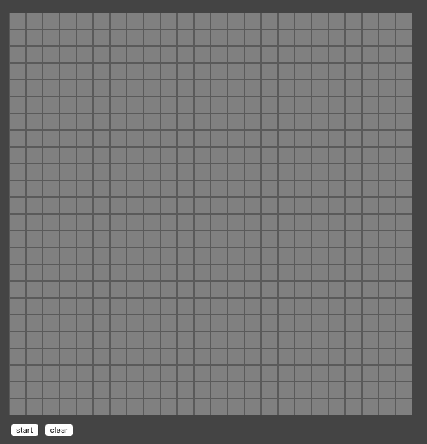

# Game-of-Life

From the Udemy Course "Build the Game of Life"

Rules:

Any live cell with fewer than two live neighbors dies, as if caused by under-population.

Any live cell with two or three live neighbors lives on to the next generation.

Any live cell with more than three live neighbors dies, as if by overcrowding.

Any dead cell with exactly three live neighbors becomes a live cell, as if by reproduction.

_________________________

Rev 1

Create the board

_________________________

Rev 2

Make board elements clickable

