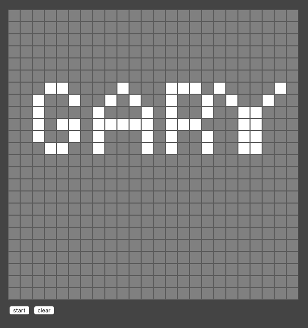

# Game-of-Life

/***
 *     _____ ____  _      _____   ____  _____   _     _  _____ _____
 *    /  __//  _ \/ \__/|/  __/  /  _ \/    /  / \   / \/    //  __/
 *    | |  _| / \|| |\/|||  \    | / \||  __\  | |   | ||  __\|  \  
 *    | |_//| |-||| |  |||  /_   | \_/|| |     | |_/\| || |   |  /_ 
 *    \____\\_/ \|\_/  \|\____\  \____/\_/     \____/\_/\_/   \____\
 *                                                                  
 */                   
_________________________

From the Udemy Course "Build the Game of Life"

_________________________

Rev 1

Create the board

_________________________

Rev 2

Make board elements clickable

